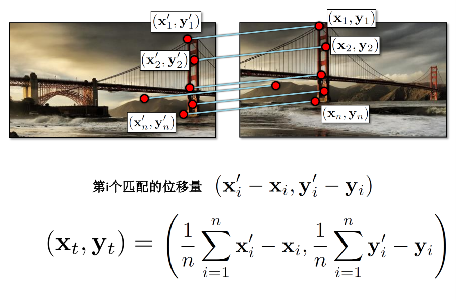
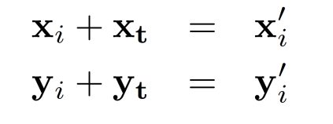

* content
{:toc}

当我们有了特征描述符之后，我们就可以进行图像的配准了

当我们对两个图片分别求出他们的角点的特征描述符，我们就可以判断两个图像是否有相似点，之后，我们甚至可以将两个图片合并。

## 理论基础

在图像的变换和卷绕中，我们已经建立了一个图片经过变换成为另一个图片的过程，事实上，我们在进行图像配准的时候，就是一个逆过程。

如果图像A经过一些变换能得到图像B，我们只需要计算出这组变换，就可以得到图像的配准，并进行拼接。

所以，寻找图片中与所有匹配项最符合的变换T就是图像配准的过程。

最简单的例子就是平移

很明显，图片B中的特征点就是图片A中特征点平移的来的。所以，只需要计算出平移量(xt, yt)，我们就可以将两个图片重叠。

我们可以通过两个图片位置坐标的差值直接获得位移量，但是这十分不恰当(因为图片总不是完全匹配的)

所以，就如图中所说，使用所有匹配点的差值的均值是一个很好的方法。

### 最小二乘法

对于仿射变换处理使用最小二乘法，这将很好的处理仿射变换，在平移问题，就相当于平均位移量。

#### 从平移说起

对于一个点（xi, yi）， 我们有

所以定义残差为

我们对于所有的匹配点求残差，这样，通过保证最小的残差平方和来求解(xt,yt)。

对于这一过程，我们也可以用矩阵表示

为了求解t，我们就形成正则方程

对于以上过程，需要注意的是，A是列满秩矩阵，否则，逆矩阵是不存在的。

当然对于非列满秩矩阵，我们还有其他方法。
$$
a^a
$$
